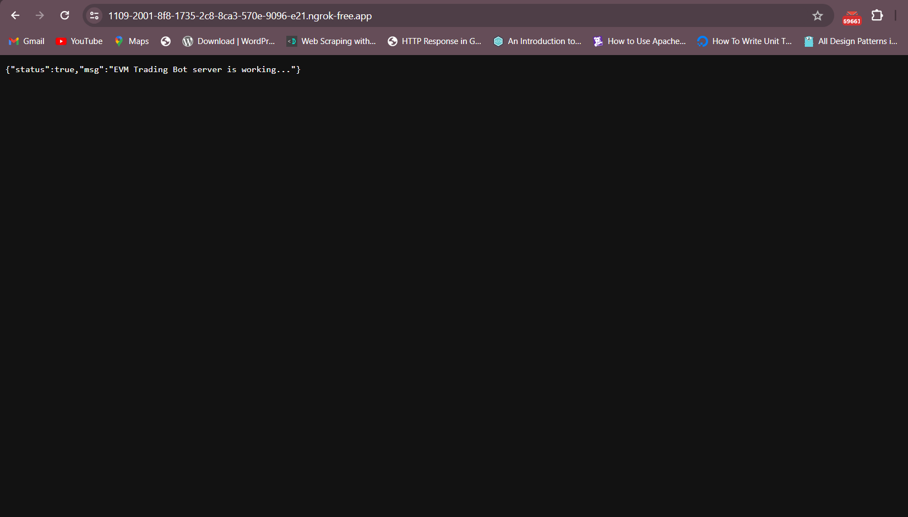
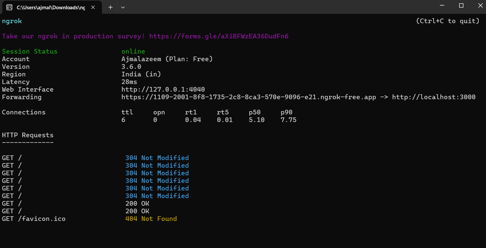
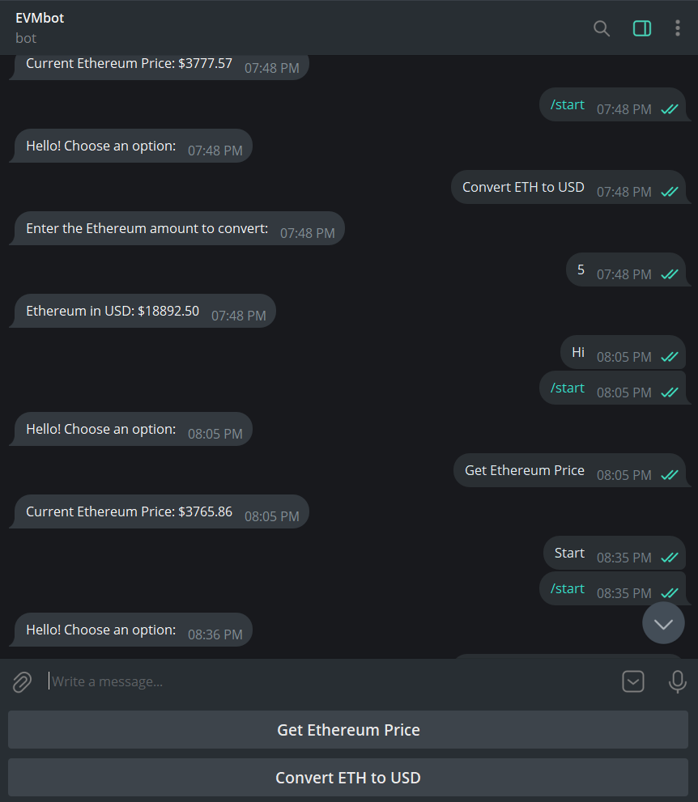
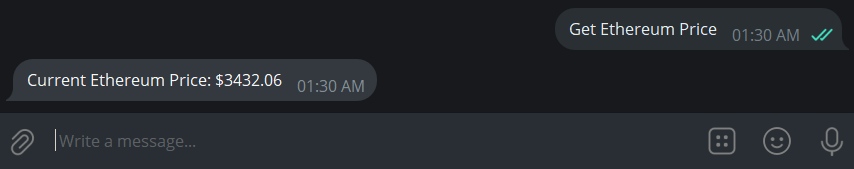
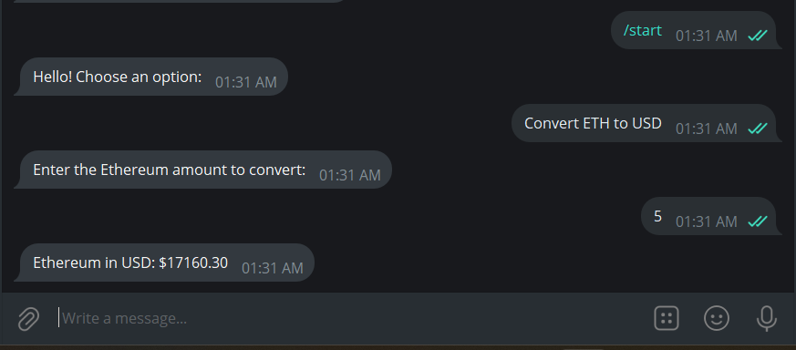

# EVM-Web3-Bot
evm web3 bot starter

telegram bot : t.me/evm_web3_bot.

server :

ngrok log:

bot features 2 buttons 

1. Get Ethereum Price
-->to fetch current ethereum amount in usd

2. Convert ETH to USD
-->will take ethereum amount from users and it converts to usd

bot /start

bot  getEthPrice button

bot convert ETH to USD

